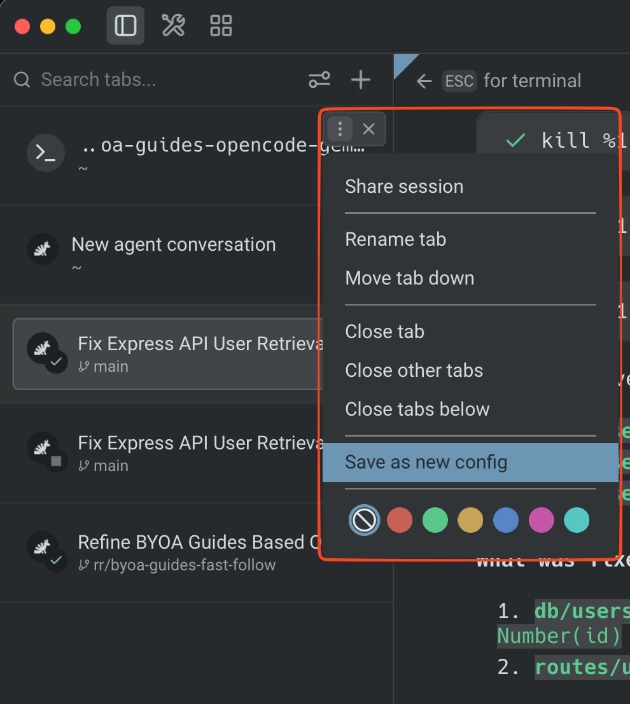
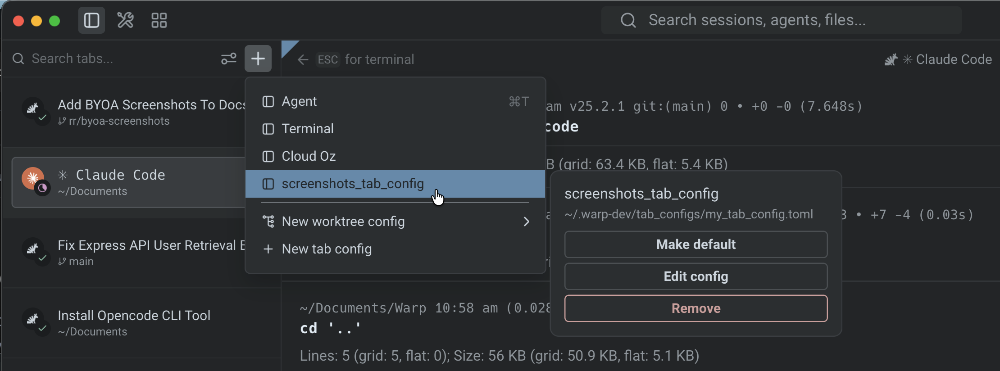

Tab Configs let you define reusable tab setups — including directory, startup commands, pane layout, shell, and theme — in a simple TOML file. Select a Tab Config from the `+` menu to open a fully configured tab with a single click.

## How Tab Configs work

Each Tab Config is a `.toml` file stored in `~/.warp/tab_configs/`. Every file defines a single tab layout with optional pane splits, startup commands, and parameterized inputs. Tab Configs appear in the `+` menu alongside your existing tabs, so you can launch a preconfigured workspace instantly.

## Creating a Tab Config

### From the UI

1. Click the **+** button in the tab bar to open the new-tab menu.
2. Click **+ New tab config**. Warp creates a new `.toml` file in `~/.warp/tab_configs/` and opens it for editing.

### Manually

1. Create a new `.toml` file in `~/.warp/tab_configs/`. Use snake_case for the file name (e.g., `dev_server.toml`).
2. Define the tab layout using the schema below, then save the file. The new config appears in the `+` menu automatically.

### Save an existing tab as a Tab Config

You can also capture a tab's current state as a reusable Tab Config without writing TOML. Right-click any tab in the [vertical tabs](/terminal/windows/vertical-tabs/) panel or horizontal tab bar to open the context menu, then click **Save as new config**. Warp generates a `.toml` file from the tab's layout, commands, and directory and adds it to the `+` menu.



## Managing Tab Configs

Saved Tab Configs appear in the `+` menu for quick access. When you hover a Tab Config in the menu, a **sidecar panel** appears alongside it with options to:

* **Edit config** — Open the underlying `.toml` file for manual editing. The editor also shows a footer to invoke the **update tab config** skill, so you can describe changes in natural language and have Warp's agent apply them.
* **Remove** — Remove the Tab Config from the `+` menu.
* **Make default** — Assign the Tab Config as the default `Cmd T` action for new tabs.



## Using skills to manage Tab Configs

Warp includes built-in skills for creating and modifying Tab Configs through natural language:

* **Create Tab Config** — Generate a new Tab Config from a description (e.g., "create a 2x2 grid with one pane running my dev server").
* **Update Tab Config** — Modify an existing Tab Config by describing the changes you want.

To use these skills, type `/skills` in Agent Mode and select the tab config skill, or use the footer that appears when editing a Tab Config file.

## Tab Config TOML schema

### Top-level fields

* **`name`** (required, string) — display name shown in the `+` menu.
* **`title`** (optional, string) — custom tab title. Supports `{{param}}` template variables.
* **`color`** (optional, string) — tab color. One of: `"black"`, `"red"`, `"green"`, `"yellow"`, `"blue"`, `"magenta"`, `"cyan"`, `"white"`. Actual color values are derived from your Warp [Theme](/terminal/appearance/themes/).

### Pane list

All panes are defined in a flat `[[panes]]` array. The first entry is the root of the pane tree. Each entry is either a **split node** (branch) or a **leaf node**.

#### Leaf node fields

* **`id`** (required, string) — unique identifier for this pane. Use descriptive names like `"editor"` or `"server"`.
* **`type`** (required, string) — `"terminal"` (standard shell), `"agent"` (opens in Agent Mode), or `"cloud"` (cloud mode pane, no local shell).
* **`directory`** (optional, string) — initial working directory. Supports `~` expansion and `{{param}}` template variables.
* **`commands`** (optional, array of strings) — commands to run in sequence when the tab opens.
* **`shell`** (optional, string) — shell executable to use for this pane (e.g. `"pwsh"`, `"zsh"`, `"bash"`, `"fish"`). Only applies to `terminal` and `agent` pane types. If omitted or the specified shell is not installed, the user's default shell is used.
* **`is_focused`** (optional, bool) — set to `true` on at most one pane to give it initial focus.

#### Split node fields

* **`id`** (required, string) — unique identifier for this split.
* **`split`** (required, string) — `"horizontal"` (children arranged left-to-right) or `"vertical"` (children arranged top-to-bottom).
* **`children`** (required, array of strings) — ordered list of child pane `id` values. Must contain at least 2 entries. Order determines visual order.

:::note
All children within a split are equally sized. There are no flex or proportion values.
:::

### Parameters

Parameters let users fill in values at open time via a modal prompt. Declare them with `[params.<name>]` tables and reference them in `directory`, `commands`, and `title` using `{{name}}` syntax.

Each parameter has:

* **`type`** (optional, string) — `"text"` (default, freeform input), `"branch"` (Git branch picker), or `"repo"` (repository picker).
* **`description`** (optional, string) — label shown in the fill-in UI.
* **`default`** (optional, string) — default value.

`{{autogenerated_branch_name}}` is a reserved template variable. If a Tab Config references it, Warp generates a unique worktree branch name on each open instead of prompting the user.

## Examples

### Single pane

A simple config that opens a terminal in a project directory and starts a dev server:

```toml
name = "Dev Server"

[[panes]]
id = "main"
type = "terminal"
directory = "~/code/my-app"
commands = ["npm run dev"]
```

### Two panes side by side

An editor and server running in parallel, with the editor focused:

```toml
name = "Editor + Server"
color = "green"

[[panes]]
id = "root"
split = "horizontal"
children = ["editor", "server"]

[[panes]]
id = "editor"
type = "terminal"
directory = "~/code/my-app"
commands = ["nvim ."]
is_focused = true

[[panes]]
id = "server"
type = "terminal"
directory = "~/code/my-app"
commands = ["npm run dev"]
```

### Cross-shell development

A config that opens two panes side by side, each with a different shell:

```toml
name = "Cross Shell"
color = "cyan"

[[panes]]
id = "root"
split = "horizontal"
children = ["bash_pane", "pwsh_pane"]

[[panes]]
id = "bash_pane"
type = "terminal"
shell = "bash"
directory = "~/code/my-app"
is_focused = true

[[panes]]
id = "pwsh_pane"
type = "terminal"
shell = "pwsh"
directory = "~/code/my-app"
```

### Worktree with parameters

A parameterized config that creates a new Git worktree on open:

```toml
name = "New Worktree"
title = "{{branch_name}}"

[[panes]]
id = "main"
type = "terminal"
directory = "{{repo}}"
commands = [
  "git worktree add -b {{branch_name}} ../{{branch_name}} {{base_branch}}",
  "cd ../{{branch_name}}",
]

[params.repo]
type = "repo"
description = "Repository path"

[params.base_branch]
type = "branch"
description = "Base branch to branch from"

[params.branch_name]
type = "text"
description = "New branch name"
default = "my-feature"
```

### Quick worktree setup

You can also create a worktree-based Tab Config directly from the `+` menu by clicking **New worktree config** and selecting the repo you want your worktree to be from. Warp generates the Tab Config automatically and saves it for future use.

## Related pages

* [Launch Configurations (Legacy)](/terminal/sessions/launch-configurations/) — the previous session configuration format. Existing configs still work, but Tab Configs are the recommended approach for new setups.
* [Tabs](/terminal/windows/tabs/) — tab management, keyboard shortcuts, and behavior settings
* [Themes](/terminal/appearance/themes/) — customize the colors used by tab color settings
* [Working Directory](/terminal/more-features/working-directory/) — how Warp resolves working directories
* [Third-Party CLI Agents](/agent-platform/cli-agents/overview/) — use the `"agent"` pane type to open tabs in Agent Mode
