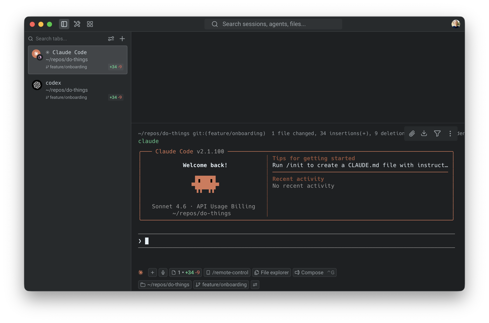
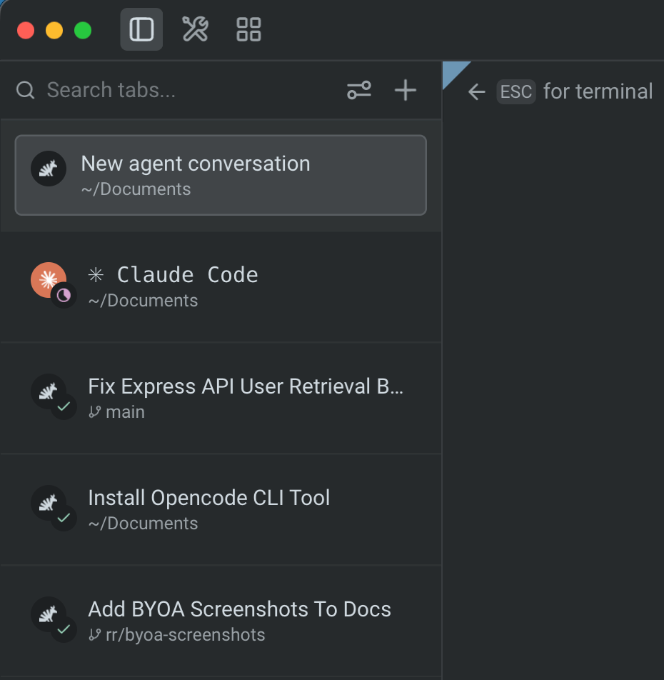
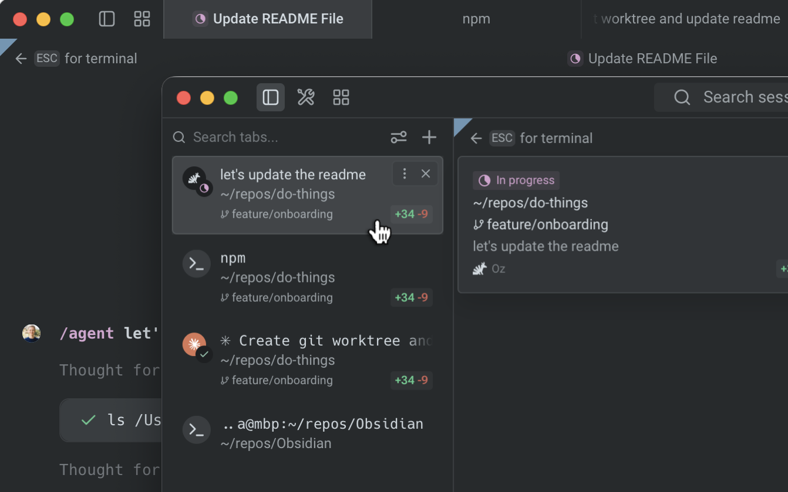
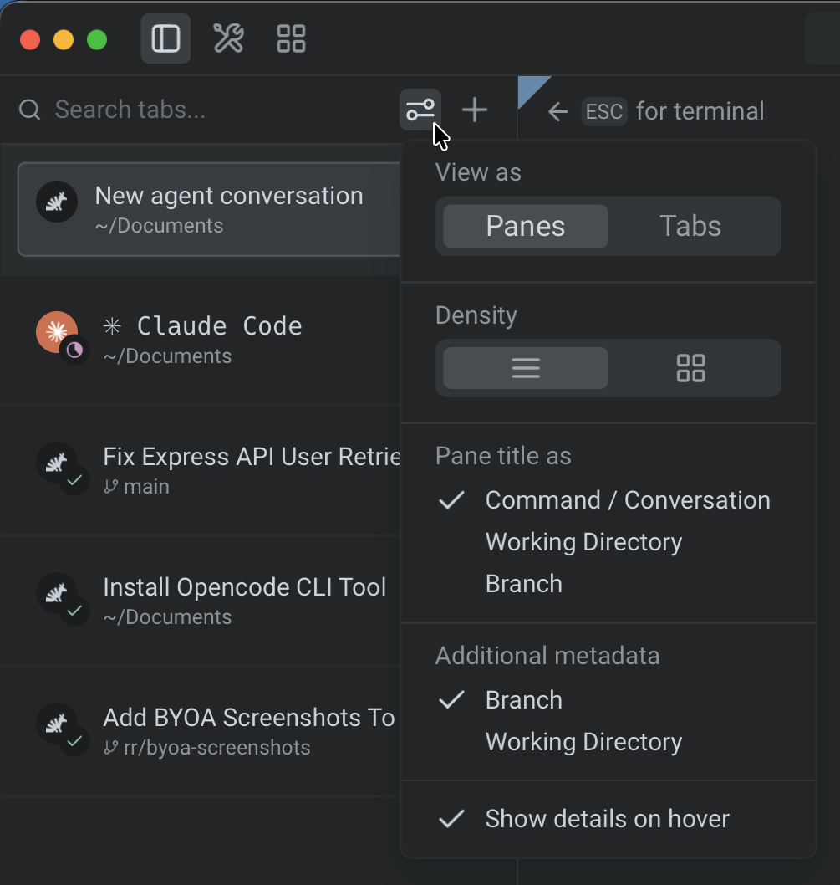
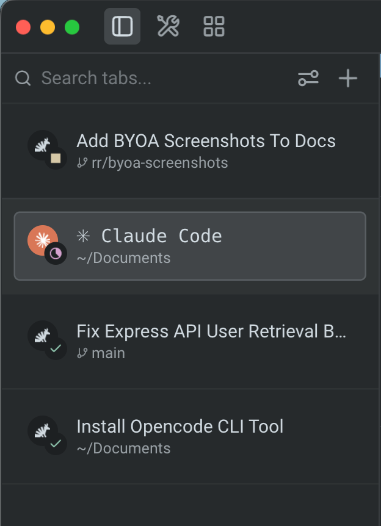
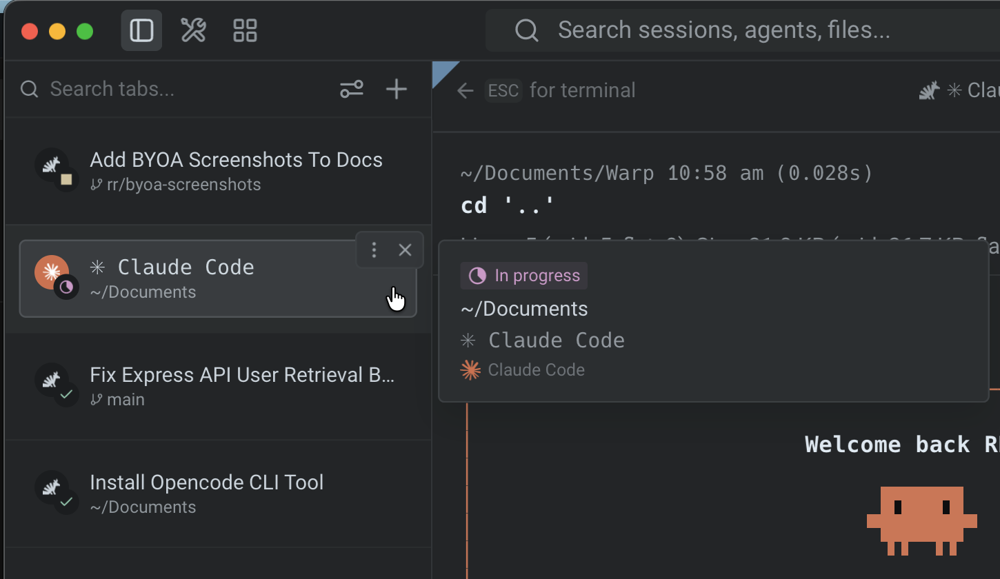

The vertical tabs panel is a sidebar that replaces the traditional horizontal tab bar with a richer, more powerful tab management surface. Instead of a single row of tab titles, the panel displays every tab and pane with contextual metadata — Git branch, working directory, agent conversation status, diff stats, and more. Scan and switch between workstreams without losing context.

Vertical tabs are especially useful when running multiple coding agents side by side, giving you a clear overview of each session's state without switching tabs.

## Key features

### Rich metadata and status

* **Pane metadata** - See working directory, Git branch, agent conversation status, diff stats, and PR badges at a glance for every pane.
* **Agent status badges** - Pane icons display a colored badge overlay showing agent state (in progress, done, errored, cancelled, or blocked). [Third-party CLI agents](/agent-platform/cli-agents/overview/) like Claude Code, Codex, and Gemini CLI display their brand icon and color alongside badges.
* **Notification indicators** - An accent-colored dot appears on pane rows with unread agent activity, so you can spot sessions that need attention without switching tabs.

### Display modes and customization

* **Pane or tab view** - Display every split pane as its own row (**Panes**) or show only the focused pane per tab (**Tabs**).
* **Compact and expanded modes** - Choose between a dense single-line view (default) or a detailed multi-line layout with full metadata.
* **Configurable pane titles** - Control which metadata appears first: last command or conversation, working directory, or Git branch.
* **Hover detail sidecar** - Hover any pane row to see full, un-clipped metadata in a floating detail card without changing focus.

### Tab management

* **Search, drag and drop, and renaming** - Filter panes by title, directory, or branch; reorder tabs or move panes between tabs by dragging; double-click a tab to rename it inline.
* **New tab menu** - Create agent tabs, terminal tabs, Oz cloud agent sessions, worktree configs, and [Tab Configs](/terminal/windows/tab-configs/) from a unified **+** menu.

## Enabling vertical tabs

To switch from horizontal tabs to the vertical tabs panel:

1. In the Warp app, navigate to **Settings** > **Appearance** > **Tabs**.
2. Toggle **Use vertical tab layout** on.

The vertical tabs panel appears as a resizable sidebar on the left side of the window. The horizontal tab bar is hidden while vertical tabs are active.

:::note
You can also toggle vertical tabs from the [Command Palette](/terminal/command-palette/) by searching for "vertical tab layout."
:::

## View modes

The vertical tabs panel supports two display densities that you can switch between at any time.

### Compact mode

Compact mode is the default. Each pane row displays an icon and title on one line, with an optional subtitle below it. The subtitle is configurable via the **Additional metadata** setting in the settings popup.

### Expanded mode

Expanded mode shows each pane row with a title, description (such as the working directory or file path), and metadata (Git branch, diff stats badge, and PR badge when available).

### Switching view modes

Click the settings icon (sliders) in the control bar at the top of the vertical tabs panel. In the popup, use the **Density** segmented control to switch between compact and expanded views. The change takes effect immediately.

## Customizing vertical tabs

When vertical tabs are enabled, configure their appearance and behavior from the settings popup (click the sliders icon in the control bar) or from **Settings** > **Appearance** > **Tabs**.

You can also rearrange the panel toggle buttons at the top of the Warp window — including the tabs panel, tools panel, agent management, code review, and notifications mailbox — and move them between the left and right sides of the header. See [Configurable toolbar](/terminal/windows/configurable-toolbar/) for details.

| Setting | Availability | Options | Default |
|---|---|---|---|
| **View as** | Always | **Panes** — each split pane gets its own row. **Tabs** — only the focused pane per tab is shown. | Panes |
| **Density** | Always | **Compact** — smaller rows with title and optional subtitle. **Expanded** — larger rows with title, description, and metadata. | Compact |
| **Pane title as** | Always | **Command / Conversation** — last command, conversation title, or CLI agent session name. **Working Directory** — pane's working directory. **Branch** — checked-out Git branch. | Command / Conversation |
| **Additional metadata** | Compact mode only | **Branch** **Working Directory** **Command / Conversation** (options depend on the **Pane title as** setting; duplicates are excluded). | Branch |
| **Show** | Expanded mode only | **PR link** — pull request and status for the current branch (requires GitHub CLI). **Diff stats** — lines added/removed. | — |
| **Show details on hover** | Always | On / Off — toggles the hover detail sidecar. | On |

### Automatic metadata

The following metadata appears automatically and doesn't require configuration:

* **Git branch** - The currently checked-out branch for the pane's working directory.
* **Worktree** - The active [Git worktree](/code/git-worktrees/) path, if applicable.
* **Agent status** - A colored badge on the pane icon indicating the agent's current state (see [Agent status badges](#agent-status-badges) below).
* **Notification dot** - An accent-colored dot on the title row when a pane has unread agent activity.

## Agent status badges

Agent pane icons display a small circular badge overlay in the bottom-right corner that reflects the agent's current state:

| Status | Icon | Meaning |
|---|---|---|
| **In progress** | Magenta clock | The agent is actively running. |
| **Done** | Green check | The agent's last turn completed successfully. |
| **Error** | Red triangle | The agent's last turn completed with an error. |
| **Cancelled** | Gray stop | The user cancelled the agent's last turn. |
| **Blocked** | Yellow stop | The agent is waiting for user approval to proceed. |

Third-party CLI agents (Claude Code, Codex, Gemini CLI, and others) display their brand icon and color inside the circular pane icon, with the same status badge overlay.

When a pane has unread agent activity, an accent-colored notification dot appears at the right edge of the title row. The dot clears when you focus the pane.

## Managing tabs

### Search

The control bar at the top of the vertical tabs panel includes a search field. Type to filter the visible tabs and panes by title, working directory, Git branch, PR label, or diff stats. Only matching tabs remain visible while the search query is active.

### New tab menu

Click the **+** button in the control bar to open the new tab menu. The menu includes:

* **Agent** - Open a new agent tab.
* **Terminal** - Open a new terminal tab.
* **Oz cloud agent** - Open a new Oz cloud agent session tab.
* **Tab Configs** - Any [Tab Configs](/terminal/windows/tab-configs/) you've created appear as menu items for one-click setup.
* **New worktree config** - Create a new worktree-based Tab Config.
* **New tab config** - Create a new Tab Config from a starter template.

### Drag and drop

Reorder tabs by dragging tab group headers within the panel. To move a pane from one tab to another, drag the pane header over a different tab group in the panel. Warp switches to that tab so you can place the pane using the standard drop targets. Dropping a pane between tab groups creates a new tab at that position.

### Tab renaming

Double-click a tab row to rename it inline. Press `Enter` to confirm or `Esc` to cancel.

:::note
Renaming applies to tabs only. Individual panes can't be renamed at this time.
:::

## Hover detail sidecar

Hover any pane row to open a floating detail card anchored to the right side of the panel. The sidecar shows full, un-clipped metadata (complete directory paths, full branch names, and the full conversation or command title) without changing which pane is focused.

The sidecar stays open as you move the cursor from the row into the card. Move away from both the row and the sidecar to dismiss it. Disable this behavior with the **Show details on hover** toggle in the settings popup.

## Keyboard shortcuts

All existing tab keyboard shortcuts continue to work with vertical tabs. The sidebar layout changes how tabs are displayed, not how you interact with them. See [Terminal tabs](/terminal/windows/tabs/) for the full list of tab shortcuts.

## Related pages

* [Terminal tabs](/terminal/windows/tabs/) - Horizontal tab bar usage and keyboard shortcuts
* [Split panes](/terminal/windows/split-panes/) - Divide tabs into multiple terminal panes
* [Tab Configs](/terminal/windows/tab-configs/) - Define reusable tab setups in TOML files
* [Git Worktrees](/code/git-worktrees/) - Worktree support that surfaces in vertical tab metadata
* [Tabs behavior](/terminal/appearance/tabs-behavior/) - Tab bar visibility, indicators, and close button settings
* [Third-party CLI agents](/agent-platform/cli-agents/overview/) - Use Claude Code, Codex, Gemini CLI, and other third-party agents with Warp's utility bar, including brand icons and status badges in the vertical tabs panel
